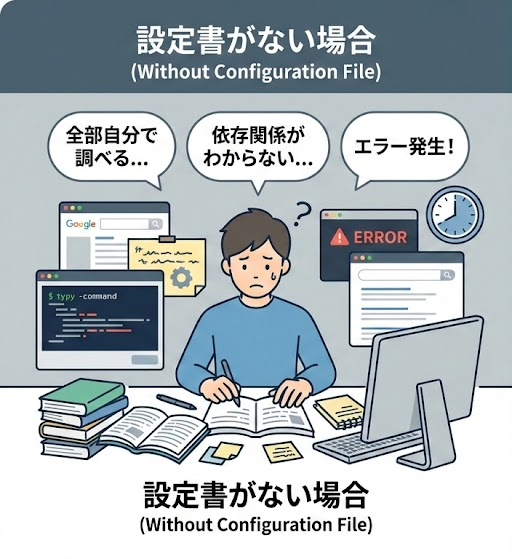
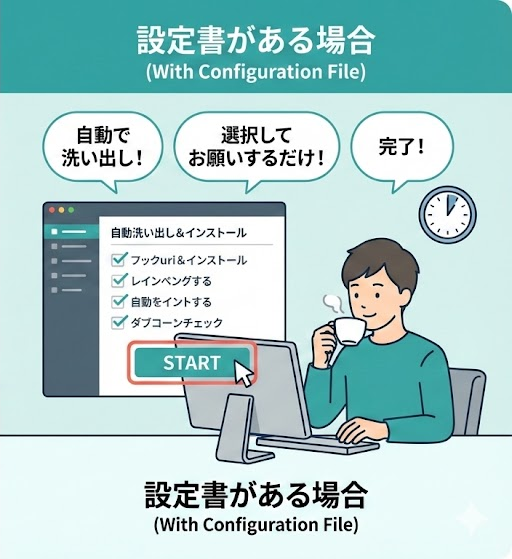

# Claude Code Development Standards

<p align="center">
  
  
  
  
  
</p>

<h3 align="center">Claude Code 開発標準</h3>
<p align="center">40年以上の経験と5,000以上のプロジェクトから生まれた実戦的なベストプラクティス</p>

<p align="center">
  <a href="#-クイックスタート">クイックスタート</a> •
  <a href="#-特徴">特徴</a> •
  <a href="#-インストール方法">インストール</a> •
  <a href="#-使い方">使い方</a> •
  <a href="#-ドキュメント">ドキュメント</a>
</p>

<p align="center">
  <a href="README.md">日本語</a> | <a href="README.en.md">English</a>
</p>

---

## 🚀 クイックスタート

30秒でセットアップ完了：

```bash
curl -sSL https://raw.githubusercontent.com/iwasaki-dev/claude-code-standards/main/scripts/install.sh | bash
```

または手動で：

```bash
git clone https://github.com/iwasaki-dev/claude-code-standards.git /tmp/claude-standards
cp -r /tmp/claude-standards/.claude .
cp /tmp/claude-standards/templates/CLAUDE.laravel.md CLAUDE.md
```

---

## ✨ 特徴

### 🎯 実戦で検証済み
- **40年以上**の開発経験
- **5,000以上のプロジェクト**で実証
- 小規模アプリから大規模エンタープライズシステムまで対応

### 📚 包括的なガイド
- ✅ **Laravel 12** + **React 18** + **Inertia.js**
- ✅ **Node.js** + **Express.js**
- ✅ **AWS** (EC2, RDS, S3) 構成
- ✅ よくあるエラーと解決策
- ✅ Git運用のベストプラクティス

### 🔧 すぐに使える
- 3コマンドでセットアップ完了
- プロジェクトテンプレート付属
- 自動更新スクリプト提供

### 🌍 オープンソース
- **MIT License** - 商用利用可能
- コミュニティ貢献歓迎
- 継続的に更新

---

## 📚 含まれている内容

### 開発原則（`.claude/standards.md`）
```markdown
✓ 調査と実装の明確な分離
✓ Git運用ルール（1機能1コミット）
✓ 禁止ファイル名パターン
✓ バックアップファイル禁止ポリシー
✓ コーディング規約
```

### エラー解消パターン（`.claude/error-patterns.md`）
```markdown
✓ 環境混在エラー → php artisan config:clear
✓ ハードコーディング問題 → 環境変数化
✓ キャッシュ問題 → デプロイ後の必須コマンド
✓ bcryptエラー → バックエンド認証実装
✓ 開発サーバー遅延 → ログクリア
```

### Laravel + React ガイド（`.claude/laravel-react-guide.md`）
```markdown
✓ なぜ Laravel + React + Inertia なのか？
✓ コーディング規約（命名規則、構造）
✓ N+1問題の回避
✓ TypeScript strict mode
✓ Tailwind CSS ベストプラクティス
```

### AWS構成ガイド（`.claude/aws-guide.md`）
```markdown
✓ 標準構成（コスト重視）
✓ EC2設定（Ubuntu 24.04）
✓ RDS設定（MySQL 8.0）
✓ S3活用パターン
✓ デプロイフロー
```

---

## 📦 インストール方法

### 方法1: ワンライナー（推奨）

```bash
curl -sSL https://raw.githubusercontent.com/iwasaki-dev/claude-code-standards/main/scripts/install.sh | bash
```

**対話形式でセットアップ：**
```
? 技術スタックを選択してください: 
  ❯ Laravel + React + Inertia
    Node.js + Express
    最小構成

? AWSを使用しますか？ (Y/n)
```

### 方法2: Git Clone

```bash
# 1. リポジトリをクローン
git clone https://github.com/iwasaki-dev/claude-code-standards.git /tmp/claude-standards

# 2. .claudeディレクトリをコピー
cp -r /tmp/claude-standards/.claude .

# 3. テンプレートをコピー
cp /tmp/claude-standards/templates/CLAUDE.laravel.md CLAUDE.md

# 4. プロジェクト固有情報を編集
nano CLAUDE.md
```

### 方法3: 手動ダウンロード

個別にファイルをダウンロード：
```bash
mkdir -p .claude

# 必須ファイル
curl -o .claude/standards.md https://raw.githubusercontent.com/iwasaki-dev/claude-code-standards/main/.claude/standards.md
curl -o .claude/error-patterns.md https://raw.githubusercontent.com/iwasaki-dev/claude-code-standards/main/.claude/error-patterns.md

# Laravel用
curl -o .claude/laravel-react-guide.md https://raw.githubusercontent.com/iwasaki-dev/claude-code-standards/main/.claude/laravel-react-guide.md

# AWS使用時
curl -o .claude/aws-guide.md https://raw.githubusercontent.com/iwasaki-dev/claude-code-standards/main/.claude/aws-guide.md
```

---

## 🎯 使い方

### CLAUDE.mdでの参照

```markdown
# My Project

## Commands
npm run dev: Start development server
php artisan serve: Start Laravel server

## Architecture
Laravel 12 + React 18 + Inertia.js

## Standards and Best Practices
@.claude/standards.md
@.claude/laravel-react-guide.md
@.claude/error-patterns.md
@.claude/aws-guide.md

## Project-specific Information
- Database: MySQL 8.0 on RDS
- Storage: S3 for file uploads
- Authentication: Laravel Breeze + Inertia
```

### Claude Codeでの使用

```bash
# プロジェクトディレクトリで
claude

# Claude Codeが自動的にCLAUDE.mdを読み込む
# /init で再生成・調整も可能
```

---

## 🔄 更新方法

最新版に更新：

```bash
curl -sSL https://raw.githubusercontent.com/iwasaki-dev/claude-code-standards/main/scripts/update.sh | bash
```

**自動的にバックアップが作成されます：**
```
.claude.backup.20251205_143022/
```

---

## 💡 実例

### Laravel + React プロジェクト
[examples/laravel-react-project/](examples/laravel-react-project/) を参照

### Node.js + Express プロジェクト
[examples/nodejs-express-project/](examples/nodejs-express-project/) を参照

---

## 📖 ドキュメント

- [はじめに](docs/getting-started.md)
- [既存プロジェクトへの導入ガイド](docs/migration-guide.md)
- [カスタマイズ方法](docs/customization.md)
- [よくある質問](docs/faq.md)
- [トラブルシューティング](docs/troubleshooting.md)

---

## 🤝 コントリビューション

Pull Request、Issue、改善提案を歓迎します！

詳細は [CONTRIBUTING.md](CONTRIBUTING.md) をご覧ください。

---

## 🌟 技術スタック

### サポートされている技術
- **Backend**: Laravel 12.x, Node.js, Express.js
- **Frontend**: React 18.x, TypeScript, Inertia.js, Tailwind CSS
- **Database**: MySQL 8.0, Redis
- **Infrastructure**: AWS (EC2, RDS, S3), CloudFront
- **Tools**: Vite, Composer, npm, PM2

### 推奨開発環境
- PHP 8.3+
- Node.js 18.x+
- MySQL 8.0+
- Ubuntu 24.04 LTS

---

## 🔍 なぜこの技術スタックなのか？

### Laravel + React + Inertia.js
✅ **API作成の手間がほぼゼロ** - Inertiaが自動でデータフローを処理  
✅ **開発スピードが速い** - Laravel と React の豊富なエコシステム  
✅ **メンテナンスしやすい** - 型安全性と明確な責務分離  
✅ **実績豊富** - 多数のプロジェクトで検証済み  

### Lambdaを避ける理由
❌ Composer依存関係の複雑さ  
❌ vendorディレクトリサイズの問題  
❌ デバッグが困難  
✅ EC2の方が制御しやすく、デバッグも容易  

---

## 📄 ライセンス

MIT License - 商用利用、改変、再配布が自由にできます。

詳細は [LICENSE](LICENSE) をご覧ください。

---

## 🙏 謝辞

このプロジェクトは、40年以上の開発経験と5,000以上のプロジェクトから得られた知見をまとめたものです。

---

## 📊 統計

- ⭐ **Stars**: このリポジトリが役に立ったらスターをお願いします！
- 🍴 **Forks**: 自由にフォークして使用してください
- 📝 **Issues**: 改善提案や質問はIssueでお願いします

---

## 🔗 関連リンク

- [Claude Code 公式ドキュメント](https://docs.anthropic.com/en/docs/claude-code)
- [Laravel 公式ドキュメント](https://laravel.com/docs)
- [React 公式ドキュメント](https://react.dev)
- [Inertia.js 公式ドキュメント](https://inertiajs.com)

---

**作成**: 開発者コミュニティ  
**最終更新**: 2025年12月5日  
**バージョン**: 2.0.0

<p align="center">
  世界中の開発者のために ❤️ を込めて
</p>

---

## 💎 完全版サービスのご案内

<p align="center">
  
  
</p>

このGitHubリポジトリでは、基本的な開発標準を無料で提供しています。

### 📦 この無料版に含まれるもの

- ✅ 開発原則（Git運用、コーディング規約）
- ✅ よくあるエラーと解決策
- ✅ Laravel + React + Inertia.js 基本ガイド
- ✅ AWS 構成の基礎

**これだけでも開発は可能です！**

---

### 🎓 さらに上を目指す方へ

**40年以上の開発経験と5,000以上のプロジェクトから得られた実践的なノウハウ**を詰め込んだ完全版をご用意しています。

#### 完全版に含まれる追加コンテンツ

**1. 環境構築ガイド（v2.0）**
- ✨ 30分〜1時間で開発環境完成
- ✨ Windows環境での最適セットアップ
- ✨ よくあるトラブルと解決策
- ✨ 初心者でも迷わない手順

**2. 開発標準 - Complete Edition**
- ✨ 実践的なケーススタディ（実際のプロジェクト事例）
- ✨ 高度な技術テクニック
- ✨ AWS コスト最適化（月額¥30,000→¥8,000の削減例）
- ✨ パフォーマンスチューニング
- ✨ 複雑なフォーム実装パターン
- ✨ N+1問題の実践的回避方法

#### 📌 こんな方におすすめ

- ✅ 開発環境の構築から学びたい
- ✅ 実際のプロジェクト事例を参考にしたい
- ✅ AWS のコスト削減方法を知りたい
- ✅ より深い技術的知見を得たい
- ✅ 40年の経験を活かした開発をしたい

---

### 🛒 完全版の入手方法

ココナラにて提供中：

👉 **[AIで開発！環境構築から開発標準まで完全サポート](https://coconala.com/services/3973687)**

**サービス内容:**
- 環境構築ガイド（v2.0）の提供
- 開発標準 Complete Edition の提供
- 継続的なアップデート
- 質問・相談サポート
